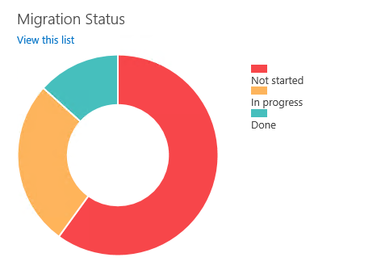

# Migration Status Overview

Javascript project for showing a migration status overview.

### Markdown extension for visual studio
For a formatted view of this file in visual studio use the following VS Extension: [https://visualstudiogallery.msdn.microsoft.com/eaab33c3-437b-4918-8354-872dfe5d1bfe](https://visualstudiogallery.msdn.microsoft.com/eaab33c3-437b-4918-8354-872dfe5d1bfe)

### Overview

## Information

More information about this project can be found on [https://msftplayground.com](https://msftplayground.com):

- [https://msftplayground.com/2014/08/custom-list-view-by-using-the-js-link-property/](https://msftplayground.com/2014/08/custom-list-view-by-using-the-js-link-property/)